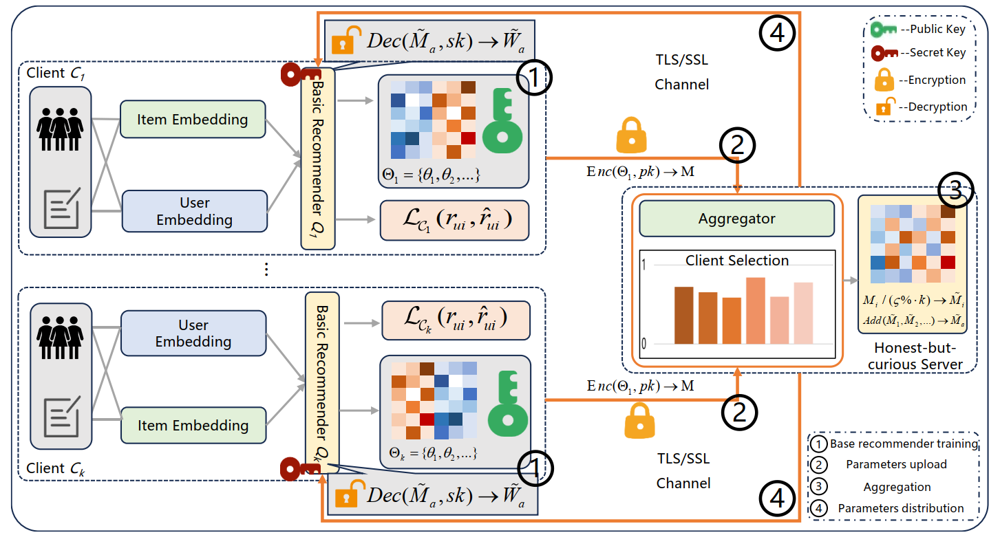
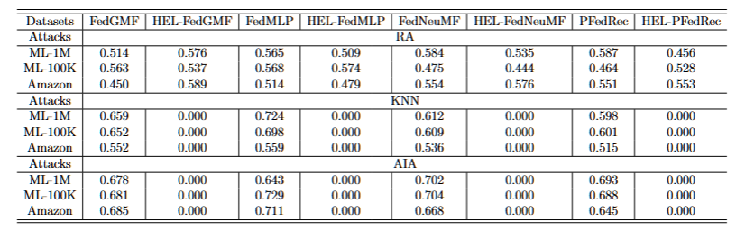

## HEL-FedRec: A General and Lightweight Privacy-preserving Federated Recommendation against Inference Attack
A lightweight privacy-preserving framework for federated recommendation using additive homomorphic encryption, achieving SOTA privacy protection with only ~1/3 communication time.
      
________________________________________
### 📋 Abstract
Federated recommendation (FedRec) enables collaborative model training without sharing raw user data. However, recent studies reveal that an honest-but-curious server can still infer sensitive user attributes from uploaded gradients, posing severe privacy risks. Existing privacy-preserving methods face three key challenges: (1) limited scenarios — hard to generalize across diverse FedRec architectures; (2) high communication costs — cryptography-based methods introduce substantial overhead; (3) difficulty in balance — obfuscation-based methods trade off recommendation accuracy for privacy.
HEL-FedRec addresses these challenges through three core innovations: - 🔐 Transferability: Integrates additive homomorphic encryption with federated averaging, compatible with general and personalized FedRecs (FedGMF, FedMLP, FedNeuMF, PFedRec) - ⚡ Lightweightness: A novel client selection strategy based on a value function (dataset size / loss reduction) reduces communication time to ~1/3 - 🎯 Efficiency: Encrypted gradients are directly aggregated without perturbation noise, preserving original optimization and recommendation performance
Extensive experiments on 5 real-world datasets demonstrate that HEL-FedRec achieves SOTA privacy protection (inference F1 score = 0) while maintaining competitive recommendation performance.
________________________________________
### 🏗️ Framework Overview

  

**Figure 1**: The overall architecture of HEL-FedRec. 
Clients train local recommenders, encrypt parameters with Paillier, 
and upload to the server for homomorphic aggregation.

___________________________________
### 📊 Experimental Results

**Figure 3.** Performance of attribute-inference attack under HEL-FedRecs and FedRecs. HEL-FedRec achieves F1 = 0 against KNN and AIA attacks on all datasets.

________________________________________
🚀 Environment
Requirements
•	Python >= 3.8
•	PyTorch >= 1.12
•	NumPy, SciPy
•	phe (Paillier encryption library)

> **Note**: This repository contains a preview of our implementation. 
> The complete codebase, including all experiments and baselines, 
> will be fully open-sourced upon paper acceptance.
